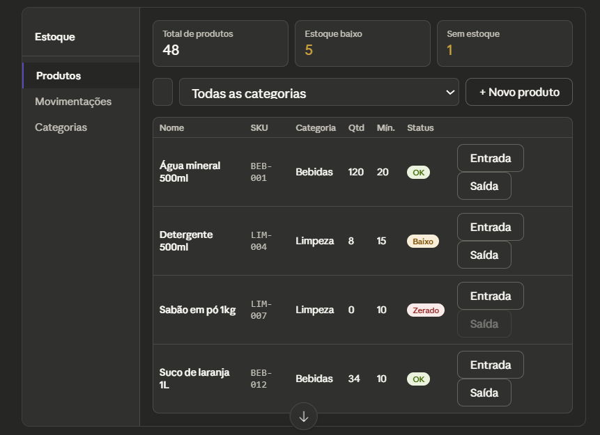
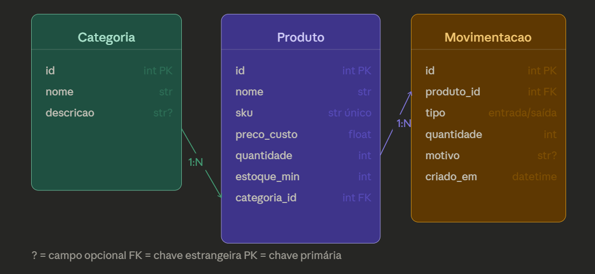

# ESTOQUE-API



## 🗺️ Fases do Projeto
#### Fase 1 — CRUD de categorias e produtos + listagem com status de estoque
#### Fase 2 — Movimentações (entrada/saída com validação de quantidade)
#### Fase 3 — Interface HTML consumindo a API
#### Fase 4 — Alertas de estoque baixo e histórico de movimentações por produto


## Estrutura de rotas

#### Organize as rotas em três grupos principais. Para categorias: **GET /categorias, POST /categorias, PUT /categorias/{id}, DELETE /categorias/{id}.** 
#### Para produtos: **GET /produtos** (com filtro por categoria e flag **?alerta=true** para estoque baixo), **POST /produtos, PUT /produtos/{id}, DELETE /produtos/{id}. Para movimentações: POST /movimentacoes** (registra entrada ou saída e já atualiza o quantidade do produto automaticamente) e **GET /movimentacoes?produto_id=X** (histórico).


## 🧱 Arquitetura do Projeto

```
estoque-api/
├── app/
│   ├── main.py
│   ├── database.py
│   ├── models/
│   │   ├── __init__.py
│   │   ├── categoria.py
│   │   ├── produto.py
│   │   └── movimentacao.py
│   ├── schemas/
│   │   ├── __init__.py
│   │   ├── categoria.py
│   │   ├── produto.py
│   │   └── movimentacao.py
│   ├── routers/
│   │   ├── __init__.py
│   │   ├── categorias.py
│   │   ├── produtos.py
│   │   └── movimentacoes.py
│   └── crud/
│       ├── __init__.py
│       ├── categoria.py
│       ├── produto.py
│       └── movimentacao.py
├── frontend/
│   ├── index.html
│   ├── style.css
│   └── app.js
├── requirements.txt
└── .env

```




