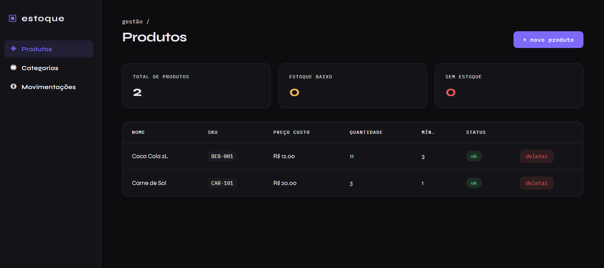

# ESTOQUE-API 📦




## Tecnologias

- [FastAPI](https://fastapi.tiangolo.com/) — framework web para a API REST
- [SQLAlchemy](https://www.sqlalchemy.org/) — ORM para acesso ao banco de dados
- [Pydantic](https://docs.pydantic.dev/) — validação de dados
- [SQLite](https://www.sqlite.org/) — banco de dados
- [Uvicorn](https://www.uvicorn.org/) — servidor ASGI
- HTML, CSS e JavaScript — interface web

---

## 🧱 Arquitetura do Projeto

```
estoque-api/
├── app/
│   ├── main.py
│   ├── database.py
│   ├── models/
│   │   ├── __init__.py
│   │   ├── categoria.py
│   │   ├── produto.py
│   │   └── movimentacao.py
│   ├── schemas/
│   │   ├── __init__.py
│   │   ├── categoria.py
│   │   ├── produto.py
│   │   └── movimentacao.py
│   ├── routers/
│   │   ├── __init__.py
│   │   ├── categorias.py
│   │   ├── produtos.py
│   │   └── movimentacoes.py
│   └── crud/
│       ├── __init__.py
│       ├── categoria.py
│       ├── produto.py
│       └── movimentacao.py
├── frontend/
│   ├── index.html
│   ├── style.css
│   └── app.js
├── requirements.txt
└── .env

```


---

## Como rodar o projeto

### 1. Clone o repositório

```bash
git clone https://github.com/seu-usuario/estoque-api.git
cd estoque-api
```

### 2. Crie e ative o ambiente virtual

```bash
python -m venv venv

# Windows
venv\Scripts\activate

# Linux / Mac
source venv/bin/activate
```

### 3. Instale as dependências

```bash
pip install -r requirements.txt
```

### 4. Suba o servidor

```bash
uvicorn app.main:app --reload
```

### 5. Acesse no navegador

| URL | Descrição |
|---|---|
| `http://127.0.0.1:8000` | Interface web |
| `http://127.0.0.1:8000/docs` | Documentação interativa (Swagger) |

---

## Endpoints da API

### Categorias — `/api/categorias`

| Método | Rota | Descrição |
|---|---|---|
| GET | `/api/categorias/` | Lista todas as categorias |
| GET | `/api/categorias/{id}` | Busca uma categoria pelo ID |
| POST | `/api/categorias/` | Cria uma nova categoria |
| DELETE | `/api/categorias/{id}` | Deleta uma categoria |

### Produtos — `/api/produtos`

| Método | Rota | Descrição |
|---|---|---|
| GET | `/api/produtos/` | Lista todos os produtos |
| GET | `/api/produtos/{id}` | Busca um produto pelo ID |
| POST | `/api/produtos/` | Cria um novo produto |
| DELETE | `/api/produtos/{id}` | Deleta um produto |

### Movimentações — `/api/movimentacoes`

| Método | Rota | Descrição |
|---|---|---|
| GET | `/api/movimentacoes/` | Lista todas as movimentações |
| GET | `/api/movimentacoes/{id}` | Busca uma movimentação pelo ID |
| POST | `/api/movimentacoes/` | Registra uma movimentação |
| DELETE | `/api/movimentacoes/{id}` | Deleta uma movimentação |

---

## Funcionalidades

- Cadastro e listagem de categorias
- Cadastro e listagem de produtos com controle de estoque mínimo
- Indicadores visuais de status: estoque ok, baixo ou zerado
- Registro de movimentações de entrada e saída
- Interface web dark mode servida pelo próprio FastAPI
- Documentação automática via Swagger em `/docs`

---

## Próximos passos

- [ ] Lógica de atualização automática de estoque nas movimentações
- [ ] Validação de saldo antes de registrar saída
- [ ] Autenticação com JWT
- [ ] Migrações com Alembic
- [ ] Filtros e busca na listagem de produtos

---

## Autor

Desenvolvido por **Welterson Gabriel**.  
Backend desenvolvido com Python e FastAPI. Interface gerada com auxílio de IA.